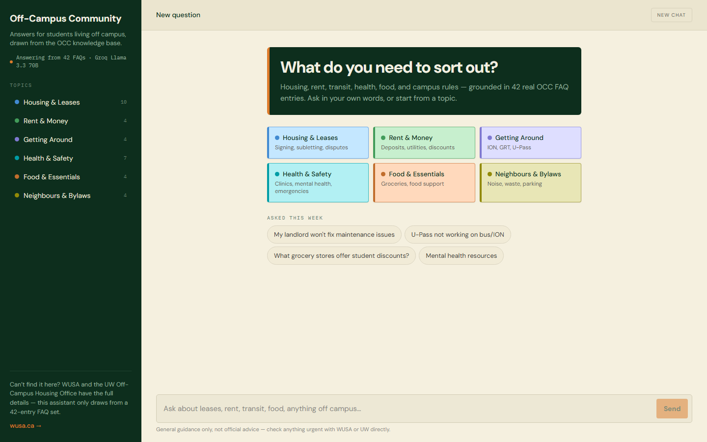
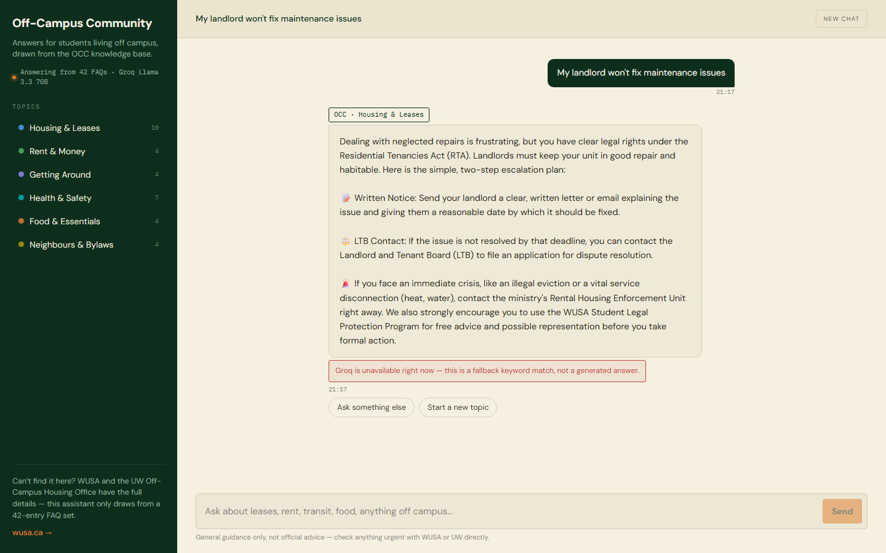
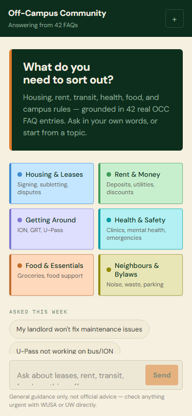
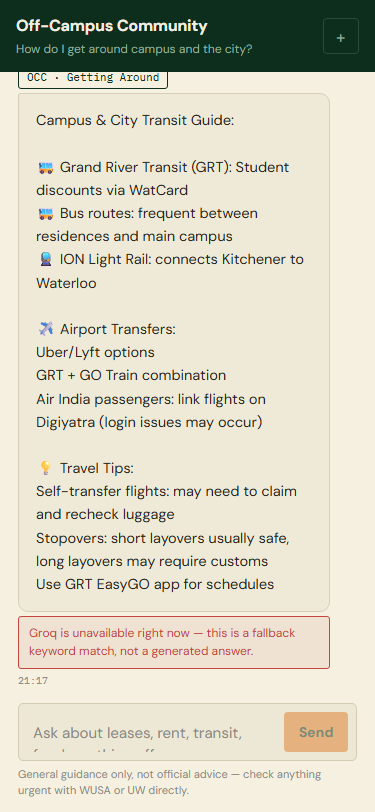
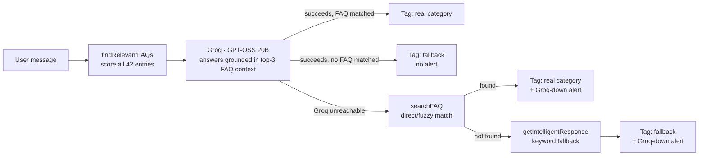

# OCC Chatbot

Answers housing, rent, transit, health, food, and campus-bylaw questions for University of Waterloo students living off campus — grounded in a 42-entry FAQ set, not a model freeform-guessing.

**Live demo:** _add your deployed frontend URL here_ · **Backend API:** [occ-chatbot.vercel.app](https://occ-chatbot.vercel.app)

   

## What it looks like

| Desktop — welcome | Desktop — answer with provenance tag |
|---|---|
|  |  |

| Mobile — welcome | Mobile — Groq-down fallback, disclosed |
|---|---|
|  |  |

The tag under every answer (`OCC · Housing & Leases`) names the real FAQ category it came from. When Groq is unreachable, the UI says so — the right screenshot above shows that state, captured in local dev without an API key.

## How it works



`POST /chat` returns `category` and `matchType` alongside the answer, so the frontend can render an honest tag instead of implying every reply is a fresh generation.

Full write-up: [HOW_IT_WORKS.md](HOW_IT_WORKS.md).

## Tech stack

Express · Groq SDK (GPT-OSS 20B) · React 18 + Vite · plain CSS (no framework) · Vercel (two projects: `backend/`, `frontend/`)

## Running locally

```bash
cd backend && npm install && npm run dev     # nodemon, http://localhost:5000 — needs GROQ_API_KEY in backend/.env
cd frontend && npm install && npm run dev    # Vite, http://localhost:3000, proxies /api to :5000
```

## Scope — v1 decisions, not gaps

- **42 FAQ entries.** Small on purpose: everything in it is accurate, not padded to look bigger.
- **In-memory chat history.** No database — history resets on every deploy or restart.
- **No auth.** Fully anonymous, stateless per session.

## Repo layout

```
Chatbot/
├── backend/
│   ├── server.js      # FAQ matching, Groq calls, all routes
│   ├── faq.json        # 42 Q&A entries, each tagged with a category
│   └── vercel.json
└── frontend/
    ├── src/components/Chatbot.jsx   # sidebar + chat UI
    ├── src/components/Chatbot.css
    └── public/                      # favicon, OG image
```
