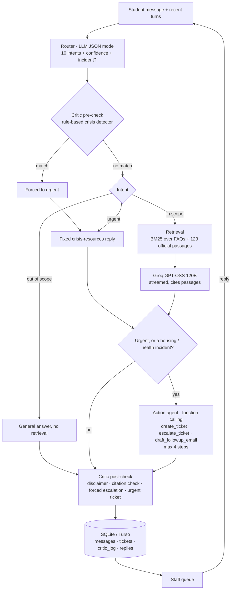

# OCC Chatbot

An AI assistant for University of Waterloo students living off campus. It answers housing, rent, transit, health, and food questions with **citations to official UW and Ontario pages**, checks leases for **clauses Ontario says are void**, flags **rental-listing scams**, and hands real problems to **a human through a staff queue**, so a student's issue doesn't end with the chatbot.

**Live demo:** https://occ-chatbot-36q6.vercel.app/ · **Backend API:** [occ-chatbot.vercel.app](https://occ-chatbot.vercel.app)

[](https://github.com/Jivesh2816/OCC-CHATBOT/actions/workflows/ci.yml)     

| Answer with cited sources + live agent trace | Lease Checker |
|---|---|
|  |  |

| Listing Scam Check | Staff queue (human in the loop) |
|---|---|
|  |  |

## Features

- **Agent pipeline with a visible trace.** Every message runs through router → safety pre-check → retrieval → action agent → critic, and the UI streams each step live (intent, confidence, what was retrieved, tools called, critic flags, per-step latency).
- **Cited answers.** Retrieval (BM25, with a minimum score so unrelated questions match nothing) searches a 42-entry FAQ plus **123 verbatim passages** scraped from UW Off-Campus Housing, the Government of Ontario, and UW Special Constable Service. Answers cite passages inline (`[1]`) with links to the source page.
- **Multi-turn memory.** Recent turns go to the router, generator, and action agent, so "what if they keep doing it?" is understood in context. Refreshing the page restores the conversation.
- **Lease Checker.** Paste a lease or upload a PDF. Ten rules (no-pets, no-guests, damage deposits, late fees, tenant-pays-repairs, entry without notice, and more) are each backed by an official passage. A regex pass and an LLM pass run together; the model can only point at clause numbers and rule ids, which are validated, so every flag quotes real lease text.
- **Listing Scam Check.** Scores a rental ad against UW Special Constable Service's rental-fraud warning signs and UW's published rent estimates. The model must quote the listing verbatim or its signal is dropped, and the risk level is computed from the validated signals, not by the model.
- **Human in the loop.** The action agent can open, escalate, and draft follow-ups on tickets through function calling. Tool arguments are validated server-side: a ticket can only be touched from its own conversation, a repeated issue reuses the open ticket instead of opening another, priorities are clamped, and follow-ups are drafts addressed to a named office for staff to send (the model never picks an email address). Every escalation alerts staff by Slack/Discord webhook or email (ticket metadata only, never the student's words). Staff work tickets from a token-protected queue (`/#/staff`), and their replies appear in the student's chat.
- **Abuse protection.** Per-IP rate limits on the endpoints that call the model, so one person can't exhaust the Groq quota and take the demo down for everyone.
- **Crisis handling that works without the model.** A rule-based detector (`lib/crisis.js`) recognizes self-harm, violence, sexual violence, immediate danger, and losing housing, including common phrasings like "end it all" or "nowhere to sleep tonight", so a crisis still gets a crisis response when Groq is down. Each kind gets its own verified resources (988, Women's Crisis Services, the Sexual Assault Support Centre, 211, and others).
- **Rule-based critic.** A deterministic safety net: it overrides the router when the crisis detector fires, adds a legal disclaimer to legal-advice phrasing, notes when an answer cites none of the official sources it was given, force-escalates high-priority tickets the agent left unescalated, and opens a ticket for any urgent message the agent didn't act on. Every decision is logged.
- **Privacy by default.** Messages and critic logs are deleted after 90 days (unresolved tickets are kept until handled), message text is kept out of server logs, staff alerts never contain student text, and the UI says all of this, including that messages go to Groq.

## How it works


```mermaid
flowchart TD
    U[Student message + recent turns] --> R[Router · LLM JSON mode<br/>10 intents + confidence + incident?]
    R --> P{Critic pre-check<br/>rule-based crisis detector}
    P -->|match| X[Forced to urgent]
    P -->|no match| I{Intent}
    X --> E[Fixed crisis-resources reply]
    I -->|urgent| E
    I -->|out of scope| G1[General answer, no retrieval]
    I -->|in scope| RT[Retrieval<br/>BM25 over FAQs + 123 official passages]
    RT --> G2[Groq GPT-OSS 120B<br/>streamed, cites passages]
    E & G2 --> A{Urgent, or a housing / health incident?}
    G1 --> C
    A -->|yes| AG[Action agent · function calling<br/>create_ticket · escalate_ticket · draft_followup_email<br/>max 4 steps]
    A -->|no| C
    AG --> C[Critic post-check<br/>disclaimer · citation check · forced escalation · urgent ticket]
    C --> DB[(SQLite / Turso<br/>messages · tickets · critic_log · replies)]
    DB --> S[Staff queue] -->|reply| U
```

More detail, including the API, data model, and design decisions: [HOW_IT_WORKS.md](HOW_IT_WORKS.md).

## Tech stack

**Backend:** Node.js 22 · Express · Groq SDK (`openai/gpt-oss-120b`), with no agent framework: the tool loop is wired directly against the chat-completions API · SQLite via `node:sqlite` locally or Turso/libSQL when hosted · BM25 retrieval (hand-written) · `unpdf` for PDF text · Nodemailer (staff email alerts).

**Frontend:** React 18 · Vite · Tailwind CSS v4 · Radix primitives · GSAP · Vanta.js · react-markdown.

**Quality:** 95 unit tests (`node:test`) covering the crisis detector, critic, ticket tools, input validation, lease rules, scam signals, retrieval ranking, staff alerts, and data retention, run by GitHub Actions on every push along with the frontend build · a 55-case eval harness that runs against the live HTTP API.

## Evaluation

`npm run eval` sends every case through the running backend, the same code path users hit. Results from 2026-09-28, local backend, Groq `openai/gpt-oss-20b`:

| Suite | Metric | Result |
|---|---|---|
| **Chat** (34 cases) | Router intent accuracy | 27/29 |
| | Answers citing an official source, when one applies | 5/5 |
| | Expected official passage retrieved | 5/5 |
| | Vague follow-ups resolved using memory | 3/3 |
| | Urgent messages that ended in an escalated ticket | 3/3 |
| **Lease** (13 leases, 13 planted clauses) | Rules + model: precision / recall | 100% / 100% |
| | Rules alone: precision / recall | 100% / 62% |
| **Scam** (8 listings) | Risk level correct | 7/8 |
| | Scams flagged medium or high · legitimate listings marked low | 5/5 · 3/3 |

Read these as a regression suite, not a benchmark: the sets are small and hand-written, and the model isn't deterministic. An earlier run the same day scored the lease suite 92% / 92% after the model flagged a snow-removal clause as a landlord repair. What's left failing is shown, not tuned away. Two intent labels are genuinely ambiguous (splitting utilities with roommates: `housing` or `rent_money`?), and one scam listing that asks for banking details before a viewing scores medium where a person would probably say high.

These results predate two later changes: the router's `incident` flag, which skips the action agent for general questions, and a stricter FAQ fallback. A re-run was blocked when the day's Groq token quota ran out. That blocked run did show how the app behaves with the model unavailable: no errors, 3/3 urgent messages still escalated to a person (the crisis check and critic don't use the model), the scam check still scored 7/8, and the lease rules alone still caught 62% of planted clauses.

## Running locally

```bash
cd backend && npm install && npm run dev      # http://localhost:5000
cd frontend && npm install && npm run dev     # http://localhost:3000 (proxies /api → :5000)
```

`backend/.env` (see [`backend/.env.example`](backend/.env.example)):

| Variable | Required | Purpose |
|---|---|---|
| `GROQ_API_KEY` | yes | LLM calls |
| `STAFF_TOKEN` | for the staff queue | Shared secret for `/#/staff`. Without it, staff routes are disabled. |
| `TURSO_DATABASE_URL`, `TURSO_AUTH_TOKEN` | for hosted persistence | Without them, data lives in a local SQLite file (on Vercel, in `/tmp`, which resets). |
| `STAFF_ALERT_WEBHOOK_URL` | recommended | Slack or Discord webhook pinged on every escalation. Without it (or SMTP below), the crisis reply doesn't promise human follow-up. |
| `SMTP_URL`, `STAFF_ALERT_EMAIL` | optional | Email alerts on escalation instead of, or as well as, the webhook. |
| `RETENTION_DAYS` | optional | How long messages and critic logs are kept (default 90). |
| `CORS_ORIGINS` | optional | Comma-separated browser origins allowed to call the API (default: the production frontend and localhost). Add preview URLs here. |
| `RATE_LIMIT_*` | optional | Per-IP limits (defaults: 12 chats/min and 100/hour; 5 lease/listing checks/min and 30/hour; 60 session reads/min). |

```bash
cd backend
npm test                # unit tests
npm run eval            # chat + lease + scam suites against a running backend (EVAL_BASE_URL to override)
npm run build:sources   # re-scrape the official passages into sources/official.json
```

## Limitations

- **Not legal advice.** The Lease Checker only knows its ten rules; a clean result doesn't mean a lease is fine.
- **Lexical retrieval.** BM25 plus a small synonym map, not embeddings, so it can miss paraphrases the synonym map doesn't cover.
- **Drafts, not email.** `draft_followup_email` saves a draft on the ticket for staff to review; nothing is sent to an office automatically.
- **Crisis detection is pattern-based.** It catches the phrasings in `test/crisis.test.js`, not every possible one; the LLM router is the first line and the detector the backstop. Add real misses to the test file.
- **Rate limits are per instance.** The counters live in memory, so on serverless they cap abuse rather than enforce an exact global quota.
- **FAQ content is unreviewed.** The 42 FAQs have no per-entry source, and some list prices or hours that may be out of date; they need review by OCC before any official use.
- **Simple staff auth.** One shared token, not per-staff accounts.
- **Snapshot sources.** Official passages are a snapshot from the date in each record's `fetchedAt`; re-run `build:sources` to refresh.
