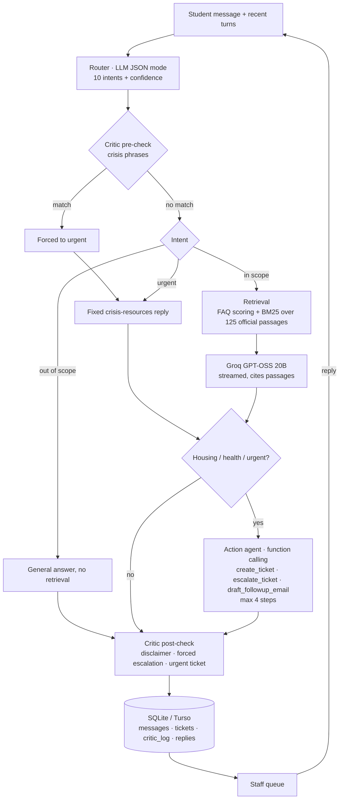

# OCC Chatbot

An AI assistant for University of Waterloo students living off campus. It answers housing, rent, transit, health, and food questions with **citations to official UW and Ontario pages**, checks leases for **clauses Ontario says are void**, flags **rental-listing scams**, and hands real problems to **a human through a staff queue**, so a student's issue doesn't end with the chatbot.

**Live demo:** https://occ-chatbot-36q6.vercel.app/ · **Backend API:** [occ-chatbot.vercel.app](https://occ-chatbot.vercel.app)

    

| Answer with cited sources + live agent trace | Lease Checker |
|---|---|
|  |  |

| Listing Scam Check | Staff queue (human in the loop) |
|---|---|
|  |  |

## Features

- **Agent pipeline with a visible trace.** Every message runs through router → safety pre-check → retrieval → action agent → critic, and the UI streams each step live (intent, confidence, what was retrieved, tools called, critic flags, per-step latency).
- **Cited answers.** Retrieval searches a curated 42-entry FAQ plus **125 verbatim passages** scraped from UW Off-Campus Housing, the Government of Ontario, and UW Special Constable Service. Answers cite passages inline (`[1]`) with links to the source page.
- **Multi-turn memory.** Recent turns go to the router, generator, and action agent, so "what if they keep doing it?" is understood in context. Refreshing the page restores the conversation.
- **Lease Checker.** Paste a lease or upload a PDF. Ten rules (no-pets, no-guests, damage deposits, late fees, tenant-pays-repairs, entry without notice, and more) are each backed by an official passage. A regex pass and an LLM pass run together; the model can only point at clause numbers and rule ids, which are validated, so every flag quotes real lease text.
- **Listing Scam Check.** Scores a rental ad against UW Special Constable Service's rental-fraud warning signs and UW's published rent estimates. The model must quote the listing verbatim or its signal is dropped, and the risk level is computed from the validated signals, not by the model.
- **Human in the loop.** The action agent can open, escalate, and draft follow-ups on tickets through function calling. Staff work them from a token-protected queue (`/#/staff`), and their replies appear in the student's chat.
- **Rule-based critic.** A deterministic safety net: it overrides the router on crisis phrases, adds a legal disclaimer to legal-advice phrasing, force-escalates high-priority tickets the agent left unescalated, and opens a ticket for any urgent message the agent didn't act on. Every decision is logged.

## How it works


```mermaid
flowchart TD
    U[Student message + recent turns] --> R[Router · LLM JSON mode<br/>10 intents + confidence]
    R --> P{Critic pre-check<br/>crisis phrases}
    P -->|match| X[Forced to urgent]
    P -->|no match| I{Intent}
    X --> E[Fixed crisis-resources reply]
    I -->|urgent| E
    I -->|out of scope| G1[General answer, no retrieval]
    I -->|in scope| RT[Retrieval<br/>FAQ scoring + BM25 over 125 official passages]
    RT --> G2[Groq GPT-OSS 20B<br/>streamed, cites passages]
    E & G2 --> A{Housing / health / urgent?}
    G1 --> C
    A -->|yes| AG[Action agent · function calling<br/>create_ticket · escalate_ticket · draft_followup_email<br/>max 4 steps]
    A -->|no| C
    AG --> C[Critic post-check<br/>disclaimer · forced escalation · urgent ticket]
    C --> DB[(SQLite / Turso<br/>messages · tickets · critic_log · replies)]
    DB --> S[Staff queue] -->|reply| U
```

More detail, including the API, data model, and design decisions: [HOW_IT_WORKS.md](HOW_IT_WORKS.md).

## Tech stack

**Backend:** Node.js 22 · Express · Groq SDK (`openai/gpt-oss-20b`), with no agent framework: the tool loop is wired directly against the chat-completions API · SQLite via `node:sqlite` locally or Turso/libSQL when hosted · BM25 retrieval (hand-written) · `unpdf` for PDF text · Nodemailer (mock transport).

**Frontend:** React 18 · Vite · Tailwind CSS v4 · Radix primitives · GSAP · Vanta.js · react-markdown.

**Quality:** 30 unit tests (`node:test`) covering the critic, lease rules, scam signals, and retrieval ranking · a 26-case eval harness that runs the real `/chat` pipeline.

## Running locally

```bash
cd backend && npm install && npm run dev      # http://localhost:5000
cd frontend && npm install && npm run dev     # http://localhost:3000 (proxies /api → :5000)
```

`backend/.env` (see [`backend/.env.example`](backend/.env.example)):

| Variable | Required | Purpose |
|---|---|---|
| `GROQ_API_KEY` | yes | LLM calls |
| `STAFF_TOKEN` | for the staff queue | Shared secret for `/#/staff`. Without it, staff routes are disabled. |
| `TURSO_DATABASE_URL`, `TURSO_AUTH_TOKEN` | for hosted persistence | Without them, data lives in a local SQLite file (on Vercel, in `/tmp`, which resets). |

```bash
cd backend
npm test                # unit tests
npm run eval            # eval set against a running backend (EVAL_BASE_URL to override)
npm run build:sources   # re-scrape the official passages into sources/official.json
```

## Limitations

- **Not legal advice.** The Lease Checker only knows its ten rules; a clean result doesn't mean a lease is fine.
- **Lexical retrieval.** BM25 plus a small synonym map, not embeddings, so it can miss paraphrases the synonym map doesn't cover.
- **Mock email.** `draft_followup_email` composes messages but never sends them.
- **Simple staff auth.** One shared token, not per-staff accounts.
- **Snapshot sources.** Official passages are a snapshot from the date in each record's `fetchedAt`; re-run `build:sources` to refresh.
